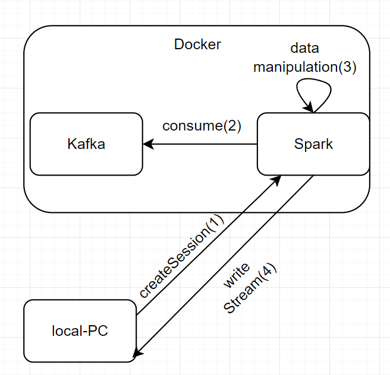

# Python streaming (kafka+spark)
### данный репозиторий позволяет поработать с вышеописанным стеком локально

### видео разбор с моего канала [YouTube](https://www.youtube.com/watch?v=OWI6nvIMIH4&t=1s)
### разбор данных примеров в текстовом формате представлен в моих статьях 
 - [на Хабре]()
 - [на Дзене]() 

### комьюнити канал в [telegram](https://t.me/boost_for_java)

### способ связи
 - [linkedin](https://www.linkedin.com/in/roman-voronovsky-79b6841b5/)
 - [telegram](https://t.me/v_d_roman)

### Взаимодействие компонент:

## Если данный репозиторий вам помог, прошу оставить комменты в статьях и под видео, это поможет распространиться данному контенту, спасибо!

